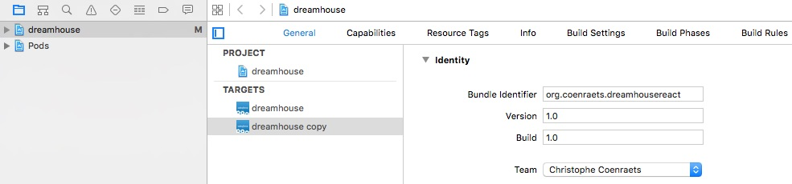

# DreamHouse React Native Mobile App

React Native iOS implementation of the DreamHouse mobile app. DreamHouse is an end-to-end sample application that demonstrates how to build apps on the Salesforce platform. Visit the [DreamHouse Microsite](http://www.dreamhouseapp.io) for more information.

This version of the application is built with React Native and the Salesforce Mobile SDK, including some new [experimental features](https://github.com/ForceDotComLabs/react.force.datacontainer) to generate parts of the UI using Salesforce metadata.

This is an experimental project published under ForceDotComLabs, which means that:

1. It's work in progress
1. We need your feedback
1. Code contributions are welcome

  

## TrailheaDX Presentation

Watch the recording of the presentation delivered at the TrailheaDX conference:

[](https://www.youtube.com/watch?v=RY2vn2bT6XU)

## Installation Instructions

1. Follow [these instructions](http://dreamhouse-site.herokuapp.com/installation/) to install the Salesforce back-end.

1. Clone this repository:
    ```
    git clone https://github.com/ForceDotComLabs/dreamhouse-mobile-react
    ```

1. Navigate to the `dreamhouse-mobile-react` directory:
    ```
    cd dreamhouse-mobile-react
    ```

1. Install the npm dependencies:
    ```
    npm install
    ```

1. Install the cocoapods dependencies:
    ```
    pod install
    ```

    If the `pod` command is not found, install cocoapods first:
    ```
    sudo gem install cocoapods
    ```

    If the installation of cocoapods fails, you may need to upgrade the version of ruby installed on your system.


1. Install [rnpm](http://facebook.github.io/react-native/releases/0.24/docs/linking-libraries-ios.html#automatic-linking) if it's not yet installed on your system:
    ```
    npm install rnpm -g
    ```

1. Link dependencies:
    ```
    rnpm link
    ```

## Run in the iOS Emulator

1. Type the following command to open the project workspace in Xcode:
    ```
    open dreamhouse.xcworkspace
    ```

1. Start the development server:
  ```
  npm start
  ```

1. in Xcode, select a phone to emulate and click **Run**

## Run on Device

1. Start the development server:
  ```
  npm start
  ```

1. In Xcode, select the **dreamhouse** project in the Project Navigator and select the **dreamhouse** target.

    

1. Specify a **Bundle Identifier** and a **Team** corresponding to a provisioning profile you created in the Apple Developer Portal.

1. Select your phone in the device selector in the toolbar, and click **Run**.

## Step-By-Step Tutorial

Follow [this step-by-step tutorial](/tutorial) to recreate the application from scratch.

## Testing

There are two types of test examples in this repo; Mocha + Enzyme component tests and image comparison based Snapshot tests.

### Mocha + Enzyme Tests
All tests live in the `__tests__` directory of the specific component with the following naming schema `componentname-enzymetest.js.` Currently there are tests for `PropertyList/ListItem` and `PropertyDetail/ActionBar`.  

To run 
```
npm run test
```

### Snapshot Tests
Snapshot tests are run from Xcode. You need to your react-native packager running and in Xcode > Product > Scheme > Edit Scheme, set an environment variable `CI_USE_PACKAGER` to 1. 

Please refer to the `dreamhouseSnapshotTests.m` file. The components that will be tested are registered in `js/testLib/snapshotTests`.
